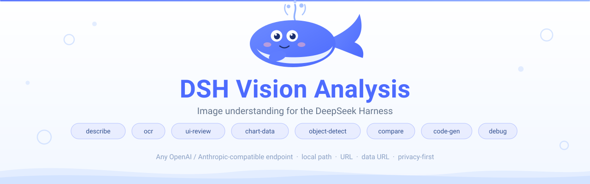
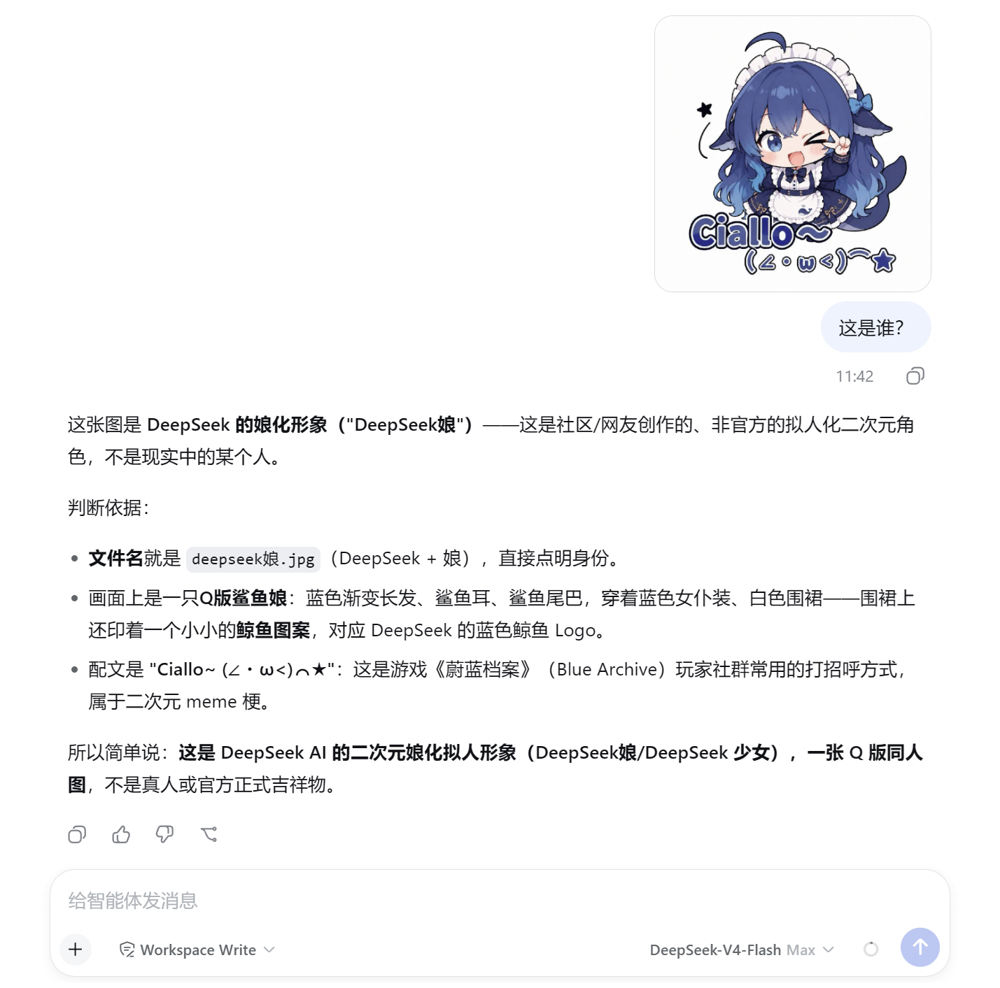
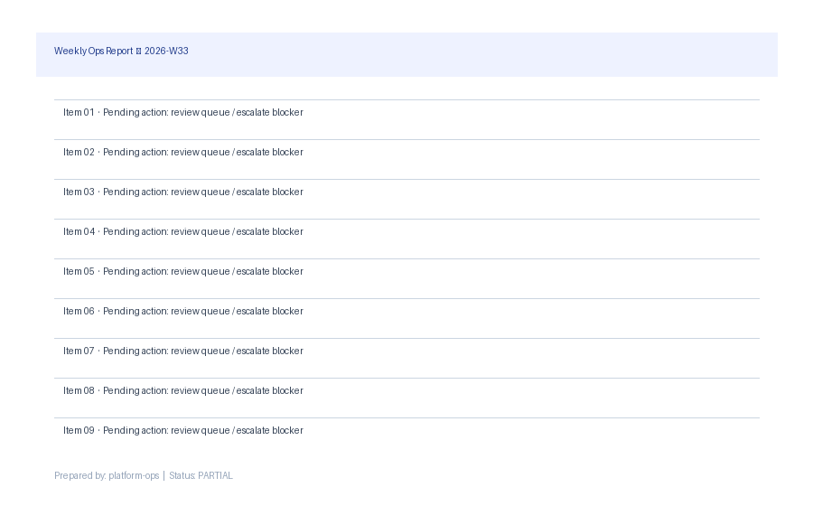
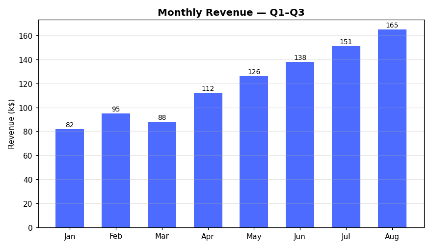
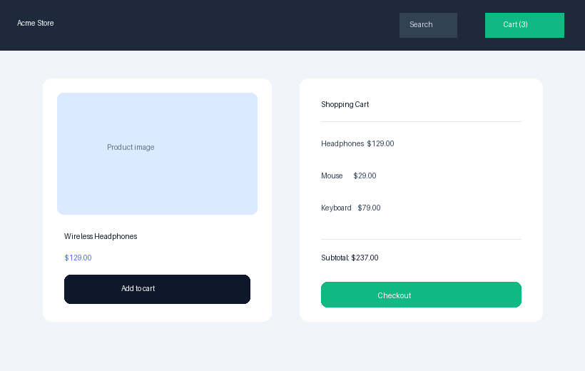

<div align="center">



[](https://www.npmjs.com/package/dsh-vision-analysis)
[](#-演示)
[](LICENSE)
[](https://github.com/deepseek-ai/deepseek-harness)
[](https://github.com/topics/dsh-plugin)
[](https://github.com/awesome-dsh-plugin/awesome-dsh-plugin)

[English](README.md) · **中文**

</div>

---

## ✨ 为什么选择 DSH Vision Analysis？

你的纯文本 Agent 终于能"看见"了——而且**内置免费视觉源**：装上插件、贴张图、直接提问。无需 API key、不用换模型、不用保存文件。

- **🆓 内置免费视觉源** —— 默认指向 OVHcloud AI Endpoints 匿名通道（Qwen2.5-VL-72B）。零成本、零密钥、零配置。
- **🖼️ 纯文本模型图片桥接** —— 对话中直接粘贴/发送图片，插件自动路由给视觉模型（原生多模态路由不受影响）。
- **🔁 限流自动切换** —— 某个视觉模型被限流时按序换下一个；全部用尽时给出清晰的恢复指引而不是报错。
- **🧾 结构化输出** —— `chart-data` 与 `ocr` 直接返回机器可读 JSON（`rows`、`lines`…），Agent 可程序化消费。
- **开箱即用的 8 种分析模式** —— `describe`、`ocr`、`ui-review`、`chart-data`、`object-detect`、`compare`、`code-gen`、`debug`，每种都带调优过的指令模板与输出参数。
- **任意视觉端点** —— 支持 OpenAI `chat/completions` **与** Anthropic `messages` 两种线协议：MiMo、Step、硅基流动、OpenRouter、Gemini（OpenAI 兼容）、GPT-4o、Claude、Qwen-VL，或本地 Ollama / LM Studio / vLLM。
- **任意输入** —— 本地绝对路径、`http(s)` URL 或 base64 `data:` URL；单次最多 4 张图，内置多图对比。
- **隐私优先设计** —— 图片字节**永不进入会话日志**、**永不到达主模型**；只有视觉模型的文本答案回到对话。`debug` 报告对 API key **完全掩码**（连前缀都不显示）。
- **生产级工程** —— 结果缓存、指数退避重试、`设置 → 插件配置` 在线改配置。
- **依赖精简** —— 运行时仅依赖 `@deepseek-ai/schemastery` 与 `@deepseek-ai/dsh-settings`。

---

## 🖼️ 演示

粘贴图片、提出问题、得到真实回答——即使是纯文本模型也可以。图片会被路由到你配置的视觉端点，分析结果直接落进对话：

<p align="center">
  
</p>

<sub>截图里：贴入图片 + 提问「这是谁？」——视觉端点识别出 DeepSeek 的娘化同人形象并逐步给出推理，全程无需切换模型、无需保存文件到本地。</sub>

### 更多场景 —— 免费视觉模型的真实输出

三种日常能力，每个场景由不同的免费视觉模型自动作答（某个模型被限流时，插件会自动切换下一个）。

**1. OCR —— 从文档/截图中提取文字**

<p align="center"></p>

> Weekly Ops Report — 2026-W33
> Item 01 · Pending action: review queue / escalate blocker
> Item 02 · Pending action: review queue / escalate blocker
> ……（所有行逐字转写）

**2. 图表 → 结构化数据，Agent 直接可用**

<p align="center"></p>

```json
{ "title": "Monthly Revenue — Q1–Q3", "rows": [["Jan","82"],["Feb","95"],…] }
```

**3. UI 评审 —— 以设计师视角审视你的界面**

<p align="center"></p>

> • "Add to cart" 与 "Checkout" 按钮样式不一致（高优先级）
> • 商品名与价格层级不够突出（中优先级）
> • 购物车条目缺少分隔、小计不够醒目（中优先级）

---

## 🚀 快速开始

```sh
# 从 GitHub 安装（无需 npm）
dsh plugin --profile web add github:Harvey-Will/dsh-vision-analysis

# 或在 Harness 插件市场里一键安装
```

重启 web profile 后，让 Agent 分析一张本地图片或链接：

> "用 analyze_image 把 `/tmp/screenshot.png` 里的文字全部转写出来。"

这一步**零配置可用**：插件默认指向免费匿名视觉端点（OVHcloud AI Endpoints，Qwen2.5-VL-72B），无需 API Key。

### 两种使用方式

**1. `analyze_image` 工具（零配置）** —— Agent 读取本地路径、`http(s)` URL 或 data URL，装完即用。

**2. 直接在对话中粘贴图片（图片桥接）** —— 需要两步配置：

- 在插件配置的 `bridgeModels` 中加入该模型；
- 在 `settings.yaml` 里给该模型的 `inputModalities` 声明 `image`（这是 Harness 放行图片消息的前提）。

```yaml
# ① ~/.dsh/settings.yaml —— llm-deepseek.models 下，给每个纯文本模型加：
#    inputModalities: [text, image]
# ② 插件配置：
bridgeModels: [deepseek-v4-flash]
```

<details>
<summary>使用自己的端点（可选）</summary>

```yaml
config:
  apiFormat: openai          # 或 anthropic
  baseURL: https://api.siliconflow.cn/v1
  apiKey: your-key           # 匿名/本地端点可留空
  model: Qwen/Qwen2.5-VL-72B-Instruct
  fallbackModels: [Qwen3.5-9B]   # 同一端点下的备用模型，429 时自动切换
```
</details>

---

## 🧭 选对模式

| 模式 | 用途 | 内置 tokens / 温度 |
|---|---|---|
| `describe` | 通用理解（默认） | 4096 / 0.7 |
| `ocr` | 截图/文档文字精确提取 | 4096 / 0.0 |
| `ui-review` | 设计评审 + 打分 | 4096 / 0.5 |
| `chart-data` | 图表转表格 + 趋势 | 4096 / 0.0 |
| `object-detect` | 物体/人物/活动识别 | 4096 / 0.5 |
| `compare` | 两张及以上对比 | 4096 / 0.5 |
| `code-gen` | UI 截图转 HTML+CSS | 4096 / 0.3 |
| `debug` | 端点连通性诊断报告 | 4096 / 0.7 |

## 🔧 工具签名

```
analyze_image(image?, images?, mode?, prompt?)
```

- `image` — 本地绝对路径、`http(s)` URL 或 `data:image/...;base64,` URL
- `images` — 多图调用，最多 `maxImages` 张（默认 2，上限 4）
- `mode` — 上述八种之一，默认 `describe`
- `prompt` — 你的精确指令，覆盖模式默认模板

> 精确指令远胜泛泛描述：`prompt: "把表格提取成 CSV"` ≫ `prompt: "描述这张图"`。

## ⚙️ 配置

```yaml
- id: vision-analysis
  name: dsh-vision-analysis
  config:
    apiFormat: openai          # openai | anthropic
    baseURL: https://api.siliconflow.cn/v1
    apiKey: ''                # 留空 → UNIVERSAL_VISION_API_KEY → 本地模型免鉴权
    model: Qwen/Qwen2.5-VL-72B-Instruct
    defaultMode: describe
    maxImages: 2              # 1-4
    maxBytes: 10485760        # 单图字节上限（10 MB）
    timeoutMs: 120000
    maxTokens: 4096
    temperature: 0.7
    modes:                    # 按模式覆盖
      ocr:
        temperature: 0.0
```

所有字段均可在 `设置 → 插件配置` 中实时修改（密钥字段自动掩码）。

---

## 🔒 安全与隐私

- **图片保持私密**：本地文件由工具读取并以 base64 内嵌发送到*你自己配置的*端点；原始字节不会进入会话日志，也不会到达主模型。
- **密钥保持机密**：绝不嵌入发往主模型的请求；`debug` 报告只显示 *已配置 / 未配置*——无前缀、无字符。
- **优先用环境变量**：尽量别把 key 写进 `cordis.yml`——使用 `UNIVERSAL_VISION_API_KEY`，或设置页中的掩码密钥字段。
- **端点不受工具审批沙箱保护**——只把工具指向你控制的端点，且只引用你信任该端点抓取的 `http(s)` 图片地址。
- 安装插件即在其权限下执行代码——安装前请审查源码。

---

## 🧩 兼容性

| | 支持情况 |
|---|---|
| DeepSeek Harness | `0.1.0-rc.x`（已在 `rc.8` 实测） |
| Node.js | `^22.19 \|\| >=24` |
| 视觉线协议 | OpenAI `chat/completions`、Anthropic `messages` |
| 图片格式 | PNG、JPEG、GIF、WebP、BMP（本地 / URL / data URL） |

> ⚠️ 社区插件，非 DeepSeek 官方产品。Harness API 处于开发者预览阶段，跨版本可能存在破坏性变更。

---

<div align="center">

**为 [DeepSeek Harness](https://github.com/deepseek-ai/deepseek-harness) 社区打造** · [dsh-plugin 话题](https://github.com/topics/dsh-plugin) · [awesome-dsh-plugin](https://github.com/awesome-dsh-plugin/awesome-dsh-plugin)

发现 Bug 或有新想法？[提交 Issue](https://github.com/Harvey-Will/dsh-vision-analysis/issues)——欢迎 PR。

[MIT License](LICENSE)

</div>
